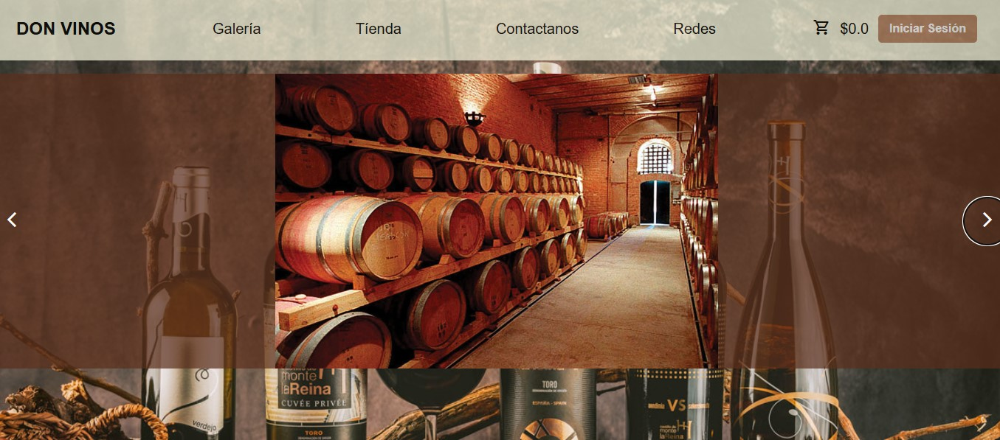
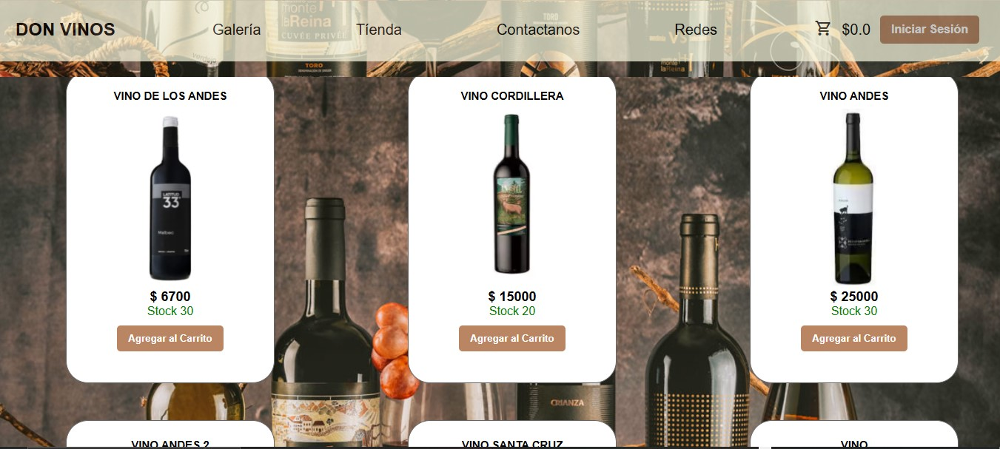

# 🍷 WineStore - E-commerce de Vinos

Proyecto desarrollado como parte del curso **Codo a Codo**, orientado a la creación de un sistema de comercio electrónico especializado en la venta de vinos.

## 🛠️ Tecnologías Utilizadas

- **Node.js**
- **Express.js**
- **JavaScript**
- **HTML5 & CSS3**
- **EJS (Plantillas)**
- **MySQL**
- **JWT (para autenticación)**
- **Bootstrap / Tailwind (según preferencia)**

## 📦 Funcionalidades Principales

- 🖼️ **Galería de Vinos:** Visualización de vinos destacados con imágenes y descripciones.
- 🛒 **Carrito de Compras:** Añadir, eliminar y modificar productos seleccionados.
- 🔐 **Sistema de Login/Registro:** Gestión de usuarios con autenticación segura.
- 🧾 **Detalle de Productos:** Página específica para cada vino con su descripción, precio y stock.
- 📊 **Panel de Administración (opcional):** Gestión de productos y usuarios (para admins).
- 💬 **Validaciones de Formularios:** Lado cliente y servidor.
- 📱 **Responsive Design:** Adaptado para dispositivos móviles.

## 🚀 Instalación y Uso

1. Clonar el repositorio:
   ```bash
   git clone https://github.com/makofig/TiendaVinos.git
   cd tiendavinos
    ```

2. Instalar dependencias: 

    npm install 

3. Crear el archivo .env 
    
    DB_HOST = 'localhost' 
    DB_USER = 'root'
    DB_DATABASE = 'vinos'
    DB_PORT = '3306'
    DB_PASSWORD = 'mi_clave'

    SECRET_KEY = 'key_secret'

## 📸 Demo

### Galería de vinos


### Selección de vinos para comprar


## 📚 Créditos
Este proyecto fue realizado como trabajo final del programa Codo a Codo Full Stack Node.js.